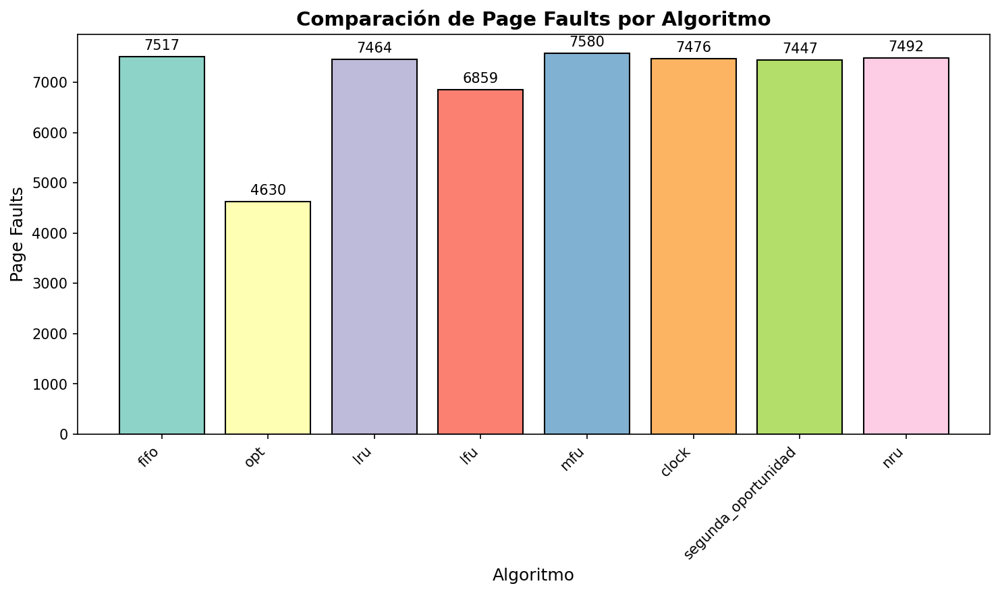
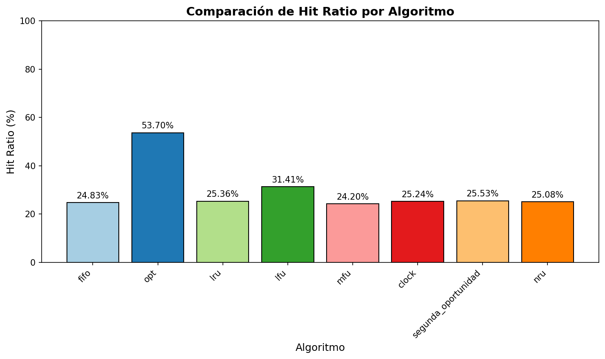
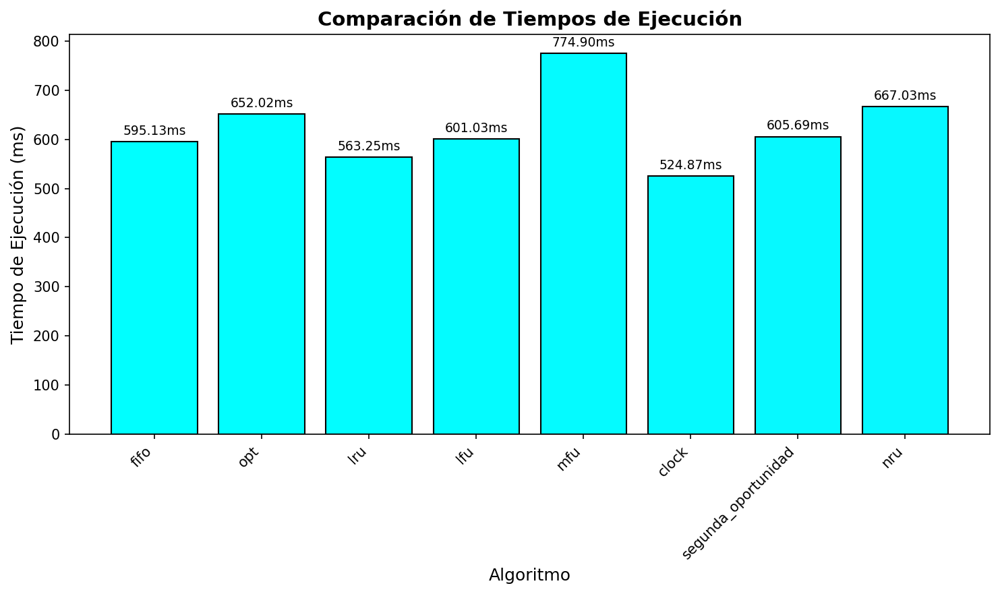
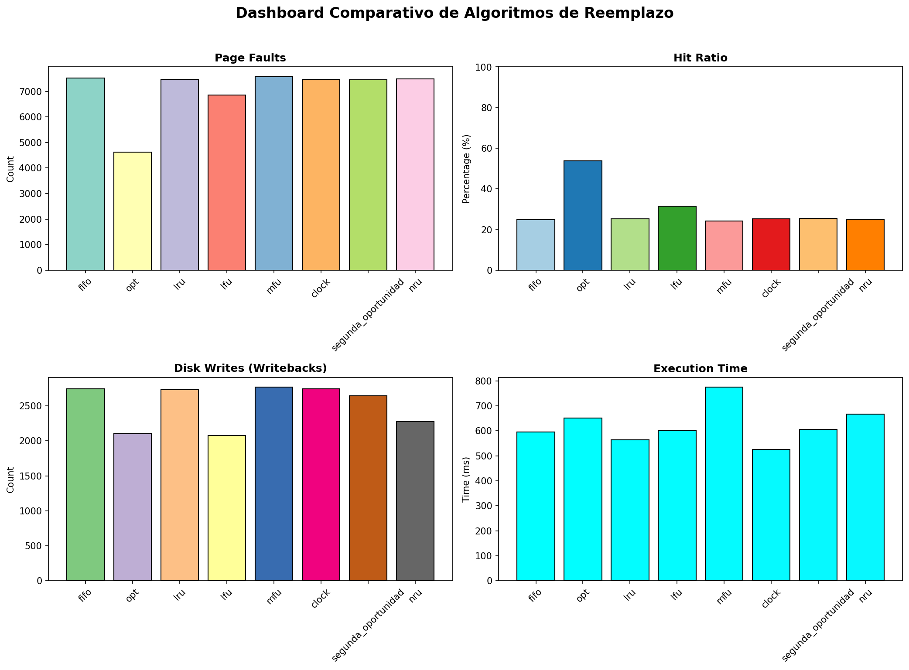

# Informe de Simulación: Algoritmos de Reemplazo de Página

**Fecha de generación:** 2026-02-27 00:57:24

## Tabla de Contenidos
1. [Descripción del Modelo](#descripción-del-modelo)
2. [Algoritmos Implementados](#algoritmos-implementados)
3. [Configuración de Simulación](#configuración-de-simulación)
4. [Resultados Comparativos](#resultados-comparativos)
5. [Gráficas](#gráficas)
6. [Conclusiones Técnicas](#conclusiones-técnicas)

## Descripción del Modelo

### Modelo de Memoria Virtual

El simulador implementa un modelo de memoria virtual con las siguientes características:

**Definición Formal:**
- Sea **P** = {p₀, p₁, ..., pₙ₋₁} el conjunto de páginas virtuales
- Sea **M** = {m₀, m₁, ..., mₖ₋₁} el conjunto de marcos de página (k < n)
- Sea **f: P → M ∪ {∅}** la función de mapeo página-marco

**Eventos del Sistema:**
1. **Page Hit:** La página solicitada está en memoria (f(p) ≠ ∅)
2. **Page Fault:** La página no está en memoria (f(p) = ∅)
   - Genera interrupción de hardware
   - Invoca llamada al sistema para carga

**Bits de Control:**
- **Bit R (Reference):** Indica acceso reciente, limpiado periódicamente
- **Bit M (Modified/Dirty):** Indica escritura, requiere writeback antes de reemplazo

## Algoritmos Implementados

### FIFO (First-In First-Out)
- **Complejidad:** O(1) selección, O(1) actualización, O(n) espacio
- **Principio:** Reemplaza la página más antigua
- **Limitación:** Anomalía de Belady

### OPT (Óptimo de Belady)
- **Complejidad:** O(n×m) selección (n marcos, m accesos futuros)
- **Principio:** Reemplaza la página que se usará más tarde
- **Nota:** Benchmark teórico, no implementable en práctica

### LRU (Least Recently Used)
- **Complejidad:** O(1) selección y actualización con estructuras adecuadas
- **Principio:** Explota localidad temporal
- **Ventaja:** Buen rendimiento en cargas con localidad

### LFU (Least Frequently Used)
- **Complejidad:** O(n) selección, O(1) actualización
- **Principio:** Reemplaza página con menor frecuencia de acceso
- **Limitación:** Páginas "viejas" con frecuencia histórica alta

### MFU (Most Frequently Used)
- **Complejidad:** O(n) selección, O(1) actualización
- **Principio:** Inverso de LFU
- **Uso:** Patrones donde frecuencia alta indica "trabajo completado"

### Clock (Reloj)
- **Complejidad:** O(1) amortizado, O(n) peor caso
- **Principio:** Aproximación de LRU con bit R
- **Ventaja:** Eficiente en hardware, ampliamente usado

### Segunda Oportunidad
- **Complejidad:** O(2n) peor caso
- **Principio:** Clock mejorado considerando bits R y M
- **Ventaja:** Minimiza I/O prefiriendo páginas limpias

### NRU (Not Recently Used)
- **Complejidad:** O(n) selección
- **Principio:** Clasificación en 4 clases por bits R y M
- **Característica:** Selección aleatoria dentro de clase

## Configuración de Simulación

| Parámetro | Valor |
|-----------|-------|
| num_frames | 8 |
| total_pages | 100 |
| num_accesses | 10000 |
| page_size | 4096 |
| access_pattern | locality |
| seed | 42 |
| write_ratio | 0.3 |

## Resultados Comparativos

| Algoritmo | Page Faults | Hit Ratio | Fault Rate | Disk Writes | Tiempo (s) | Interrupciones | Syscalls |
|-----------|-------------|-----------|------------|-------------|------------|----------------|----------|
| fifo | 7517 | 24.83% | 75.17% | 2744 | 0.5951 | 7517 | 10261 |
| opt | 4630 | 53.70% | 46.30% | 2103 | 0.6520 | 4630 | 6733 |
| lru | 7464 | 25.36% | 74.64% | 2732 | 0.5633 | 7464 | 10196 |
| lfu | 6859 | 31.41% | 68.59% | 2076 | 0.6010 | 6859 | 8935 |
| mfu | 7580 | 24.20% | 75.80% | 2768 | 0.7749 | 7580 | 10348 |
| clock | 7476 | 25.24% | 74.76% | 2742 | 0.5249 | 7476 | 10218 |
| segunda_oportunidad | 7447 | 25.53% | 74.47% | 2644 | 0.6057 | 7447 | 10091 |
| nru | 7492 | 25.08% | 74.92% | 2276 | 0.6670 | 7492 | 9768 |

## Gráficas

### Page Faults

### Hit Ratio

### Tiempo de Ejecución

### Dashboard Combinado

## Conclusiones Técnicas

### Mejor Rendimiento General

- **Menor Page Faults:** opt (4630 faults)
- **Mayor Hit Ratio:** opt (53.70%)
- **Menos Escrituras a Disco:** lfu (2076 writes)
- **Menor Tiempo de Ejecución:** clock (0.5249s)

### Análisis por Patrón de Acceso

**Patrón utilizado:** locality

- Para patrones con **alta localidad**, LRU y sus aproximaciones (Clock, Segunda Oportunidad)
  generalmente superan a FIFO.
- **OPT** sirve como benchmark teórico del mínimo posible de page faults.
- Algoritmos basados en **frecuencia** (LFU/MFU) pueden rendir mal con patrones cambiantes.

### Impacto en Sistemas Reales

1. **Overhead de I/O:** Las escrituras a disco (writebacks) son costosas.
   Algoritmos como Segunda Oportunidad que consideran el bit M reducen este costo.

2. **Complejidad de Implementación:**
   - LRU puro requiere actualizar estructuras en cada acceso
   - Clock y NRU son aproximaciones eficientes usadas en sistemas reales

3. **Anomalía de Belady:** FIFO puede exhibir comportamiento donde más memoria = más faults.

### Recomendaciones

- **Para sistemas de propósito general:** Clock o Segunda Oportunidad
- **Para workloads con alta localidad:** LRU o aproximaciones
- **Para minimizar I/O:** Segunda Oportunidad (considera bit M)
